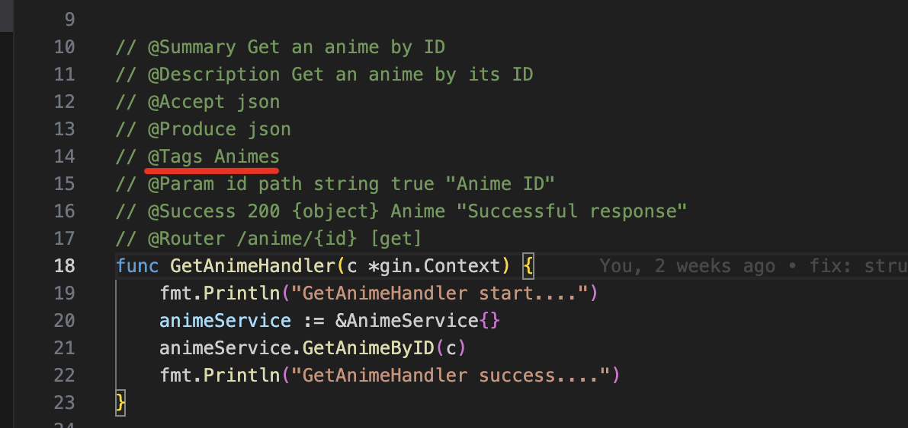

# Quick Start!!
Play in Just 2 Steps
   ```
   make up
   ```
   ```
   make run
   ```
<div style="text-align:center">

   ...........................👍 💯 ........................... 

</div>
<br/>

# Additional Information!!
## 🐳 Create Local Database with Docker Compose
To create a local database using Docker Compose, follow these steps: 
1. **Install Docker Compose:** If you haven't already, make sure you have Docker Compose installed on your system. 


2. **Create a Docker Compose YAML File:** Create a docker-compose.yml file in your project directory
      ```
      version: "3.3"
      services:
      db:
         image: "postgres:14.2"
         restart:
            unless-stopped
         ports:
            - "5430:5432"
         environment:
            POSTGRES_USER: postgres
            POSTGRES_PASSWORD: postgres
            POSTGRES_DB: "go_demo"
      ```

3. **Start Container:** In the same directory where your docker-compose.yml file is located,

   ```
   docker-compose up -d
   ```
   or using a Makefile.
   ```
   make up
   ```

4. **Kafka:** You can open Kafka UI at http://localhost:8090/ui  

## 🧹✨ Clean Code

   Using 'go mod tidy' will automatically remove unused packages from the go.sum file
   
   ``` clean go sum and go mod
   go mod tidy
   ``` 


## 🌱 Create Swagger

1. **Set up API for display on Swagger.**
  

2. **Generate docs file.**  
   ```
   swag init
   ```
   if problem is gennerage docs for swagger

   'zsh: command not found: swag'
   ```
   export PATH=$PATH:$(go env GOPATH)/bin 
   ```
   ```
   swag init -g main.go — output docs
   ```

3. **Run.**  
   ```
   go run main.go
   ```
4. **Open Swagger API**
   http://localhost:8080/go-demo/swagger/index.html
